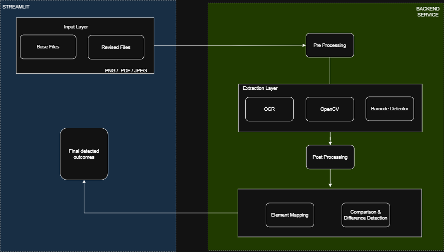

# Image Comparison and Difference Detection

This repository houses a sophisticated multi-component API pipeline that analyzes structural and textual differences between a base document and one or more revised iterations. It leverages classical computer vision and greedy text-matching similarity metrics to filter out chaotic OCR and layout noise, reporting only pure business value changes.

---
### System Architecture

---

## 🚀 Setup & Installation

### 1. Prerequisites
You must have Python 3.10+ installed on your workspace.

Furthermore, because this architecture executes low-level system binaries for optical extraction, your host system requires the following two packages:
- **Tesseract OCR**: Required for text parsing.
  - *Windows*: Download standard binary, then verify `tesseract.exe` lives inside `C:\Program Files\Tesseract-OCR` or add to System PATH.
- **ZBar**: Required for barcode / datamatrix.
  - *Windows*: Required to have ZBar binaries on path (defaults currently probe toward `C:\Program Files\ZBar\bin`).

### 2. Environment Configuration
Clone the repository and securely isolate the dependencies:
```bash
python -m venv venv
# On Windows:
venv\Scripts\activate
# On Linux/Mac:
source venv/bin/activate
```

### 3. Install Requirements
```bash
pip install -r requirements.txt
```
*(Note: If testing on Windows, `pymupdf` should install correctly natively, circumventing complex `poppler` errors that typically crash PDF parsers).*

---

## 🔌 Running the Server

Start the localized ASGI server locally with Uvicorn:
```bash
uvicorn app.main:app --reload --port 8001
```

Once running, navigate your browser to the interactive GUI hosted at:
**[http://127.0.0.1:8001/docs](http://127.0.0.1:8001/docs)**

---

## 📊 Pipeline Functionality

The pipeline automatically manages:
1. **Intelligent Ingestion**: `PNG`, `JPEG`, and flattened `PDF` forms.
2. **Preprocessing Cleanup**: Non-destructive Deskewing angulation rotation. Assures flawless alignment prior to Tesseract ingestion while actively guarding against pixel-degradation (allowing Tesseract's native sub-pixel Leptonica rendering to thrive).
3. **Triple-Layer Target Identification**: 
    - Text (Line Grouped logically)
    - Non-text Graphics (OpenCV boundaries) 
    - Barcodes/Symbols (via ZBar)
4. **Structured Diff Evaluation**: Additions, Removals, and verified Content Modifications that explicitly silence 2-3 pixel jitter formatting flags.
 
**Output Paths**:
- Immediate API `JSON` payload response.
- A full persistent HTML Document mapping written silently back to `output/` directory!

---

## 🖥️ Streamlit Visual Dashboard

This repository now includes an interactive **Streamlit Visual Dashboard** that physically draws difference boxes mapped to their precise geometries on dual side-by-side images! 
It operates as a frontend client, meaning it pipes directly into your raw FastAPI backend.

1. Ensure your core backend is securely running in your primary terminal:
   ```bash
   uvicorn app.main:app --reload --port 8001
   ```
2. Open a **second terminal window**, ensure your virtual environment is activated (`venv311\Scripts\activate`).
3. Boot the visual dashboard:
   ```bash
   streamlit run streamlit_app.py
   ```
4. A browser window will automatically launch! Simply drag and drop your Base + Revised images into the sidebar and watch the interactive diff mappings appear!
